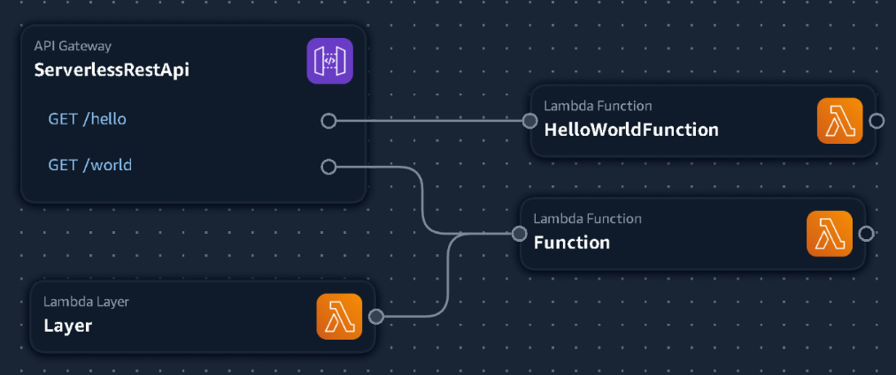

# AWS-SAM-Typescript-Walkthough
This repository is a walkthough of my process of creating an AWS SAM application using Typescript.

While having made several attempts at following tutorials; playing with different samples / starter examples none of them felt right.
Some I'm sure make more sense; and are better for various reasions, but as a begining they didn't help me understand the process very well.

If I mention an article/tutorial you wrote, please don't take my remarks to heart.

For the remainder of this article I will be using nodejs20.x; I have no idea if it will apply to other versions of node, but don't see why it wouldn't.

**Goals:**

1) A typescript based SAM project
2) Easy builds
3) 

## Contents
- [Where is starts.](#where-it-starts)
- [Initial sam-app Testing](#initial-sam-app-testing)
- [Adding a New Function](#adding-a-new-function)
- [Creating a Layer](#creating-a-layer)

# Where it starts.

It all starts from the [AWS SAM cli](#TODO).

```
$ sam init --runtime nodejs20.x
Which template source would you like to use?
        1 - AWS Quick Start Templates
        2 - Custom Template Location
Choice:
```

Great! We're provided with a choice of [starter templates](https://github.com/aws/aws-sam-cli-app-templates/tree/master/nodejs20.x) or a custom template of our own. Lets start with an AWS provided 

```
Choose an AWS Quick Start application template
        1 - Hello World Example
        2 - GraphQLApi Hello World Example
        3 - Hello World Example with Powertools for AWS Lambda
        4 - Multi-step workflow
        5 - Standalone function
        6 - Scheduled task
        7 - Data processing
        8 - Serverless API
        9 - Full Stack
        10 - Lambda Response Streaming
Template:
```

So far so simple.... Lets keep it simple and use the `Hello World Example`. (1)

```
Based on your selections, the only Package type available is Zip.
We will proceed to selecting the Package type as Zip.

Based on your selections, the only dependency manager available is npm.
We will proceed copying the template using npm.

Select your starter template
        1 - Hello World Example
        2 - Hello World Example TypeScript
Template:
```

Obviously we'll select 2 because... Well, Typescript Right?

```
Would you like to enable X-Ray tracing on the function(s) in your application?  [y/N]:
```

Nope; Keeping it simple.

```
Would you like to enable monitoring using CloudWatch Application Insights?
For more info, please view https://docs.aws.amazon.com/AmazonCloudWatch/latest/monitoring/cloudwatch-application-insights.html [y/N]:
```

No... Keeping it simple....

```
Would you like to set Structured Logging in JSON format on your Lambda functions?  [y/N]:
```

No.. Wait! Yes... that'll make debugging simpiler. Right?

```
Project name [sam-app]:
```

Sure..

```

    -----------------------
    Generating application:
    -----------------------
    Name: sam-app
    Runtime: nodejs20.x
    Architectures: x86_64
    Dependency Manager: npm
    Application Template: hello-world-typescript
    Output Directory: .
    Configuration file: sam-app/samconfig.toml

    Next steps can be found in the README file at sam-app/README.md


Commands you can use next
=========================
[*] Create pipeline: cd sam-app && sam pipeline init --bootstrap
[*] Validate SAM template: cd sam-app && sam validate
[*] Test Function in the Cloud: cd sam-app && sam sync --stack-name {stack-name} --watch
```

OK; Now we have our `sam-app` folder and the Hello World Tutorial. Lets `cd sam-app` and test.

## Initial sam-app Testing

Lets ignore the suggested next commands; and see what we are given and if we can get it running.

Opening the `template.yaml` file in [Application Composer](#TODO) we see the following:


Great! A simple `GET /hello` request will call our `HelloWorldFunction`.

Lets try it out locally! (*I'm not running "locally" but a remote server so I need to add a --host flag so I can access the endpoint from my workstation*)

```
$ sam local start-api --host 10.0.0.1
Initializing the lambda functions containers.
Local image is up-to-date
Using local image: public.ecr.aws/lambda/nodejs:20-rapid-x86_64.

Mounting /home/sniper7kills/AWS-SAM-Typescript-Walkthough/sam-app/hello-world as /var/task:ro,delegated, inside runtime container
Containers Initialization is done.
Mounting HelloWorldFunction at http://10.0.0.1:3000/hello [GET]
You can now browse to the above endpoints to invoke your functions. You do not need to restart/reload SAM CLI while working on your functions, changes will be reflected instantly/automatically. If you used sam build before running local commands, you  
will need to re-run sam build for the changes to be picked up. You only need to restart SAM CLI if you update your AWS SAM template
2024-02-12 13:34:24 WARNING: This is a development server. Do not use it in a production deployment. Use a production WSGI server instead.
 * Running on http://10.0.0.1:3000
2024-02-12 13:34:24 Press CTRL+C to quit
```

OK; so lets send a request to that endpoint.

```
Invoking app.lambdaHandler (nodejs20.x)
Reuse the created warm container for Lambda function 'HelloWorldFunction'
Lambda function 'HelloWorldFunction' is already running
START RequestId: 232d34e7-b5bb-4b27-95e4-0bac1ea96426 Version: $LATEST
{"timestamp":"2024-02-12T18:36:21.882Z","level":"ERROR","message":{"errorType":"ImportModuleError","errorMessage":"Error: Cannot find module 'app'\nRequire stack:\n- /var/runtime/index.mjs","stackTrace":["Runtime.ImportModuleError: Error: Cannot find module 'app'","Require stack:","- /var/runtime/index.mjs","    at _loadUserApp (file:///var/runtime/index.mjs:1087:17)","    at async UserFunction.js.module.exports.load (file:///var/runtime/index.mjs:1119:21)","    at async start (file:///var/runtime/index.mjs:1282:23)","    at async file:///var/runtime/index.mjs:1288:1"]}}
12 Feb 2024 18:36:21,890 [ERROR] (rapid) Init failed error=Runtime exited with error: exit status 129 InvokeID=
12 Feb 2024 18:36:21,890 [ERROR] (rapid) Invoke failed error=Runtime exited with error: exit status 129 InvokeID=9b4dbadb-120c-49e8-bcb5-da7a2eaf4636
12 Feb 2024 18:36:21,891 [ERROR] (rapid) Invoke DONE failed: Sandbox.Failure

2024-02-12 13:36:22 10.0.0.225 - - [12/Feb/2024 13:36:22] "GET /hello HTTP/1.1" 500 -
```

OK.. We got an 500 response and obviously an error.

If you guessed "thats because you didn't build it" you are correct. So lets do that. `CTRL + C` and build.

```
$ sam build --use-container
Starting Build use cache
Starting Build inside a container
Cache is invalid, running build and copying resources for following functions (HelloWorldFunction)
Building codeuri: /home/sniper7kills/AWS-SAM-Typescript-Walkthough/sam-app/hello-world runtime: nodejs20.x metadata: {'BuildMethod': 'esbuild', 'BuildProperties': {'Minify': True, 'Target': 'es2020', 'Sourcemap': True,        
'EntryPoints': ['app.ts']}} architecture: x86_64 functions: HelloWorldFunction

Fetching public.ecr.aws/sam/build-nodejs20.x:latest-x86_64 Docker container image......
Mounting /home/sniper7kills/AWS-SAM-Typescript-Walkthough/sam-app/hello-world as /tmp/samcli/source:ro,delegated, inside runtime container
 Running NodejsNpmEsbuildBuilder:CopySource
 Running NodejsNpmEsbuildBuilder:NpmInstall
 Running NodejsNpmEsbuildBuilder:EsbuildBundle

Sourcemap set without --enable-source-maps, adding --enable-source-maps to function HelloWorldFunction NODE_OPTIONS

You are using source maps, note that this comes with a performance hit! Set Sourcemap to false and remove NODE_OPTIONS: --enable-source-maps to disable source maps.


Build Succeeded

Built Artifacts  : .aws-sam/build
Built Template   : .aws-sam/build/template.yaml

Commands you can use next
=========================
[*] Validate SAM template: sam validate
[*] Invoke Function: sam local invoke
[*] Test Function in the Cloud: sam sync --stack-name {{stack-name}} --watch
[*] Deploy: sam deploy --guided
```

Did you catch that `--use-container` flag? I'm using that to ensure my builds are the same regardless of where they are running. (I.E. locally right now; but in GithubActions in the future as well)

With it built; lets try running and connecting again.

```
$ sam local start-api --host 10.0.0.1
Initializing the lambda functions containers.
Local image is up-to-date
Using local image: public.ecr.aws/lambda/nodejs:20-rapid-x86_64.

Mounting /home/sniper7kills/AWS-SAM-Typescript-Walkthough/sam-app/.aws-sam/build/HelloWorldFunction as /var/task:ro,delegated, inside runtime container
Containers Initialization is done.
Mounting HelloWorldFunction at http://10.0.0.1:3000/hello [GET]
You can now browse to the above endpoints to invoke your functions. You do not need to restart/reload SAM CLI while working on your functions, changes will be reflected instantly/automatically. If you used sam build before running local commands, you  
will need to re-run sam build for the changes to be picked up. You only need to restart SAM CLI if you update your AWS SAM template
2024-02-12 13:45:23 WARNING: This is a development server. Do not use it in a production deployment. Use a production WSGI server instead.
 * Running on http://10.0.0.1:3000
2024-02-12 13:45:23 Press CTRL+C to quit
Invoking app.lambdaHandler (nodejs20.x)
Reuse the created warm container for Lambda function 'HelloWorldFunction'
Lambda function 'HelloWorldFunction' is already running
START RequestId: 887bfc20-853e-4b6b-9b74-100a7f0469da Version: $LATEST
END RequestId: 8b592d98-1ec4-4e8d-8f67-c6bcdc0382c5
REPORT RequestId: 8b592d98-1ec4-4e8d-8f67-c6bcdc0382c5  Init Duration: 0.04 ms  Duration: 52.13 ms      Billed Duration: 53 ms  Memory Size: 128 MB     Max Memory Used: 128 MB

No Content-Type given. Defaulting to 'application/json'.
2024-02-12 13:45:28 10.0.0.225 - - [12/Feb/2024 13:45:28] "GET /hello HTTP/1.1" 200 -
```

Sweet! we got it running; and we got back the expected "Hello World" message in the response.

**COMMIT 1**

## Adding a New Function

OK; so we now have a TypeScript Lambda function; it shouldn't be hard to create another one.

Lets add a new API endpoint; along with a new Lambda Function. (Again in Application Composer)


**COMMIT 2**

OK; so now I get to start with some complaints and issues I have.

I'm only going to briefly touch on them in this document; but I'll link to where I go into more detail.

- [Application Compose generates boiler plate too quickly!](./docs/Issues.md#issue-1)
- [Boiler Plate doesn't match expected code from "hello world"](./docs//Issues.md#issue-2)

OK; Ignoring those two issues; lets built and run it.

```
$ sam build --use-container
Starting Build use cache
Starting Build inside a container
Cache is invalid, running build and copying resources for following functions (Function)
Building codeuri: /srv/samba/sda/RunbookSolutions/appsyncTests/AWS-SAM-Typescript-Walkthough/sam-app/src/Function runtime: nodejs20.x metadata: {'BuildMethod': 'esbuild', 'BuildProperties': {'EntryPoints': ['index.mts'], 'External': ['@aws-sdk/*',     
'aws-sdk'], 'Minify': False}} architecture: x86_64 functions: Function
Valid cache found, copying previously built resources for following functions (HelloWorldFunction)

Fetching public.ecr.aws/sam/build-nodejs20.x:latest-x86_64 Docker container image......
Mounting /srv/samba/sda/RunbookSolutions/appsyncTests/AWS-SAM-Typescript-Walkthough/sam-app/src/Function as /tmp/samcli/source:ro,delegated, inside runtime container

Build Failed
 Running NodejsNpmEsbuildBuilder:CopySource
 Running NodejsNpmEsbuildBuilder:NpmInstall
 Running NodejsNpmEsbuildBuilder:EsbuildBundle
Error: NodejsNpmEsbuildBuilder:EsbuildBundle - Esbuild Failed: Cannot find esbuild. esbuild must be installed on the host machine to use this feature. It is recommended to be installed on the PATH, but can also be included as a project dependency. 
```

Really? I can't even **build** the boiler plate code.

So we need to make some changes:
1) modify `src/Function/package.json`
```diff
 {
   "name": "function",
   "version": "1.0.0",
   "type": "module",
+  "dependencies": {
+    "esbuild": "0.20.0"
+  },
   "devDependencies": {
     "@types/aws-lambda": "~8"
   }
 }
```

While were in here lets also "improve" the default typescript file.
1) modify `src/Function/index.mts`

```diff
- import { Handler } from "aws-lambda";
+ import { Context, APIGatewayProxyCallback, APIGatewayEvent } from 'aws-lambda';

- export const handler: Handler<object, object> = async event => {
-  // Log the event argument for debugging and for use in local development.
-  console.log(JSON.stringify(event, undefined, 2));
- 
-  return {};
- };
+ export const handler = (event: APIGatewayEvent, context: Context, callback: APIGatewayProxyCallback): void => {
+    console.log(`Event: ${JSON.stringify(event, null, 2)}`);
+    console.log(`Context: ${JSON.stringify(context, null, 2)}`);
+    callback(null, {
+        statusCode: 200,
+        body: JSON.stringify({
+            message: 'hello world',
+        }),
+    });
+};
```

And now it build; and when we send a `GET /world` we recieve a 200 response.

Its not hard... But it would be nice for this to be customizable.

**COMMIT 3**

## Adding a Layer

Ok, so at this point we *could* consider this walkthough as complete; but there is a major component missing. Lambda Layers.

Lets create a drop a new Lambda Layer and attach it to our Lambda Function.



And looking at the "boiler plate" code for the layer we see..... Nothing. [We see nothing because it didn't provide us with anything.](/docs/Issues.md#issue-3) **Thanks AWS!** *And yes; this is regardless of the language you select*

So lets look at what changes it made to our `template.yaml` file.

```diff
...
   Function:
     Type: AWS::Serverless::Function
     Properties:
       Description: !Sub
         - Stack ${AWS::StackName} Function ${ResourceName}
         - ResourceName: Function
       CodeUri: src/Function
       Handler: index.handler
       Runtime: nodejs20.x
       MemorySize: 3008
       Timeout: 30
       Tracing: Active
       Events:
         ServerlessRestApiGETworld:
           Type: Api
           Properties:
             Path: /world
             Method: GET
+      Layers:
+        - !Ref Layer
     Metadata:
       BuildMethod: esbuild
       BuildProperties:
         EntryPoints:
           - index.mts
         External:
           - '@aws-sdk/*'
           - aws-sdk
         Minify: false
...
+  Layer:
+    Type: AWS::Serverless::LayerVersion
+    Properties:
+      Description: !Sub
+        - Stack ${AWS::StackName} Layer ${ResourceName}
+        - ResourceName: Layer
+      ContentUri: src/Layer
+      RetentionPolicy: Retain
```

OK; so we know where we should put our code; but then what? How is it built?
```
$ sam build --use-container
Starting Build use cache
Starting Build inside a container
Valid cache found, copying previously built resources for following functions (Function)
Valid cache found, copying previously built resources for following functions (HelloWorldFunction)

Sourcemap set without --enable-source-maps, adding --enable-source-maps to function HelloWorldFunction NODE_OPTIONS

You are using source maps, note that this comes with a performance hit! Set Sourcemap to false and remove NODE_OPTIONS: --enable-source-maps to disable source maps.


Build Succeeded

Built Artifacts  : .aws-sam/build
Built Template   : .aws-sam/build/template.yaml

Commands you can use next
=========================
[*] Validate SAM template: sam validate
[*] Invoke Function: sam local invoke
[*] Test Function in the Cloud: sam sync --stack-name {{stack-name}} --watch
[*] Deploy: sam deploy --guided
```

But... Our "Layer" wasn't built; and thats because we didn't specify a "Build Method" for the layer.

Looking at the options; we see nodejs20.x; but nothing for typescript.
Unfortuantly that won't build our typescript. (**If you know otherwise; please let me know!**)

So lets select "makefile" in order to give us some more control of the workflow, and check the changes in our template.

```diff
...
   Layer:
     Type: AWS::Serverless::LayerVersion
     Properties:
       Description: !Sub
         - Stack ${AWS::StackName} Layer ${ResourceName}
         - ResourceName: Layer
       ContentUri: src/Layer
       RetentionPolicy: Retain
+    Metadata:
+      BuildMethod: makefile
...
```

**COMMIT 4**

Before we start to code the layer I want to explain how a lambda layer works; at least from my understanding. (**Please let me know where I'm wrong!**)

- A layer is simply a zip containing a folder structure that will be mounted onto `/opt`.
- Different runtimes will have different `/opt` paths in the runtimes `$PATH` (I.E. Node, Python, Etc. know to look in specific `/opt` directories for files)

NodeJS in particular loads the following paths into the `NODE_PATH` variable. [Ref](https://docs.aws.amazon.com/lambda/latest/dg/packaging-layers.html)
```
layer.zip/
└── nodejs/
    ├── node_modules
    ├── node14/
    │   └── node_modules
    ├── node16/
    │   └── node_modules
    └── nodejs18/
        └── node_modules
```

With this in mind; I would like to take a momment and explain an issue of frustration I've had with tutorial up to this point.

Why hasn't anyone made the semi-obvious statement that for NodeJS layers; you **MUST** build your common components and libraries as packages.

Looking now, it seems obvious. But the way its done in some tutorials or examples makes no sense to me.

### Coding The Layer

With the knowladge that we will be building a package lets get started.

```sh
mkdir src/Layer
cd src/Layer
npm init
```
And we'll go though the process of creating the package.

```
This utility will walk you through creating a package.json file.
It only covers the most common items, and tries to guess sensible defaults.

See `npm help init` for definitive documentation on these fields
and exactly what they do.

Use `npm install <pkg>` afterwards to install a package and
save it as a dependency in the package.json file.

Press ^C at any time to quit.
package name: (layer) layer
```
> [!IMPORTANT] 
> This will be the most important question. Because of the way layers work, we want to ensure that we don't acidently overwrite something provided by another layer. (*Again, not fully sure how this works...*) It's also the name we'll use when importing anything we need within our functions.

```
version: (1.0.0) 0.0.1
description: My Custom Lambda Layer
entry point: (index.js) dist/index.js
test command:
git repository:
keywords:
author: Sniper7Kills
license: (ISC) UNLICENSED
About to write to /home/sniper7kills/AWS-SAM-Typescript-Walkthough/sam-app/src/Layer/package.json:

{
  "name": "layer",
  "version": "0.0.1",
  "description": "My Custom Lambda Layer",
  "main": "dist/index.js",
  "scripts": {
    "test": "echo \"Error: no test specified\" && exit 1"
  },
  "author": "Sniper7Kills",
  "license": "UNLICENSED"
}


Is this OK? (yes) yes
```

Now we need to enable typescript.

```sh
npm i typescript --save-dev
npx tsc --init
mkdir src
touch src/index.ts
cd ../..
```

And finally lets create a function and export it.

```typescript
// sam-app/src/Layer/src/index.ts
export function myCustomFunction() {
  console.log('my custom function')
}
```

**COMMIT 5**

At this point we should be back in the "sam-app" directory.

While we could build the layer from within its directory, we want to keep it simple and ensure SAM builds it for us. (Hence why we selected makefile over NodeJS)

If we were to try to build now; it would fail as we never created a Makefile; so lets create it.

```make
# sam-app/src/Layer/src/index.ts
build-Layer:
    npm run clean # Clean the environment
    npm install   # Install our Dependencies
    npm run build # Build our package // Layer

    # This is a NodeJS Layer; lets make the directory structure in the Artifacts Directory
    mkdir -p "$(ARTIFACTS_DIR)/nodejs/node_modules"

    # Is the following block needed? Is it correct?
    # Copy our package.json and -lock.json to the Artifacts Directory
    cp package.json package-lock.json "$(ARTIFACTS_DIR)/nodejs"
    # Install the production dependencies
    npm install --production --prefix "$(ARTIFACTS_DIR)/nodejs"
    # Remove our package.json file
    rm "$(ARTIFACTS_DIR)/nodejs/package.json" 

    # Copy our built code to the Artifacts Directory
    cp -r dist "$(ARTIFACTS_DIR)/nodejs/node_modules"
```

Now if we try to build; we get a different error:
```
$ sam build --use-container
Starting Build use cache
Starting Build inside a container
Cache is invalid, running build and copying resources for following layers (Layer)
Building layer 'Layer'
For container layer build, first compatible runtime is chosen as build target for container.

Fetching public.ecr.aws/sam/build-provided:latest-x86_64 Docker container image......
Mounting /home/sniper7kills/AWS-SAM-Typescript-Walkthough/sam-app/src/Layer as /tmp/samcli/source:ro,delegated, inside runtime container

Build Failed
Layer: Running CustomMakeBuilder:CopySource
Layer: Running CustomMakeBuilder:MakeBuild
Layer: Current Artifacts Directory : /tmp/samcli/artifacts
npm run clean # Clean the environment
Error: CustomMakeBuilder:MakeBuild - Make Failed: /bin/sh: npm: command not found
make: *** [build-Layer] Error 127
```

OK; now the error doesn't give you an exact "Oh this is what I need to do"; but I'll give you a hint. How does SAM know that this is supposed to be a TypeScript layer? We've only told it that its going to be build using a Makefile.

Lets make some changes to the `template.yaml` file;

> ![IMPORTANT]
> You are unable to make the following changes from within `Application Composer`; and will no longer be used within this Walkthough. Also note; you may need to make these changes multiple times as [Application Composer tends to overwrite/change these settings](./docs/Issues.md#issue-4) when going back into Application Composer.

```diff
...
   Layer:
     Type: AWS::Serverless::LayerVersion
     Properties:
       Description: !Sub
         - Stack ${AWS::StackName} Layer ${ResourceName}
         - ResourceName: Layer
       ContentUri: src/Layer
       RetentionPolicy: Retain
+      CompatibleRuntimes:
+        - nodejs20.x
     Metadata:
       BuildMethod: makefile
...
```

Now when we try to build; we don't get an error about npm not being found; but that we are missing the script "clean". Which makes sense as we didn't define it yet.

```diff
// sam-app/src/Layer/package.json
 {
   "name": "layer",
   "version": "0.0.1",
   "description": "My Custom Lambda Layer",
   "main": "dist/index.js",
   "scripts": {
     "test": "echo \"Error: no test specified\" && exit 1",
+    "clean": "rm -rf dist node_modules",
+    "build": "npx tsc"
   },
   "author": "Sniper7Kills",
   "license": "UNLICENSED",
   "devDependencies": {
     "typescript": "^5.3.3"
   }
 }
```

Lets also modify our tsconfig.json to customize the build.

```diff
 {
   "compilerOptions": {
     ...
-    // "outDir": "./",
+    "outDir": "./dist",
   }
 }
 ```

 Now we can run `sam build --use-container` without issue; But how can we use this custom function within our Lambda Function?

 Lets make the following changes:

 ```diff
// sam-app/src/Function/index.mts
  import { Context, APIGatewayProxyCallback, APIGatewayEvent } from 'aws-lambda';
 
+ import { myCustomFunction } from 'layer'
 
  export const handler = (event: APIGatewayEvent, context: Context, callback: APIGatewayProxyCallback): void => {
      console.log(`Event: ${JSON.stringify(event, null, 2)}`);
      console.log(`Context: ${JSON.stringify(context, null, 2)}`);
+    myCustomFunction()
      callback(null, {
          statusCode: 200,
          body: JSON.stringify({
              message: 'hello world',
          }),
      });
  };
 ```

 Try to build; and you'll get an error:
 ```
 Build Failed
 Running NodejsNpmEsbuildBuilder:CopySource
 Running NodejsNpmEsbuildBuilder:NpmInstall
 Running NodejsNpmEsbuildBuilder:EsbuildBundle
Error: NodejsNpmEsbuildBuilder:EsbuildBundle - Esbuild Failed: ✘ [ERROR] Could not resolve "layer"

    index.mts:3:33:
      3 │ import { myCustomFunction } from 'layer'
        ╵                                  ~~~~~~~

  You can mark the path "layer" as external to exclude it from the bundle, which will remove this error and leave the unresolved path in the bundle.
 ```

 To resolve this we need to update the `template.yaml` file:

 ```diff
   Function:
     Type: AWS::Serverless::Function
     Properties:
       Description: !Sub
         - Stack ${AWS::StackName} Function ${ResourceName}
         - ResourceName: Function
       CodeUri: src/Function
       Handler: index.handler
       Runtime: nodejs20.x
       MemorySize: 3008
       Timeout: 30
       Tracing: Active
       Events:
         ServerlessRestApiGETworld:
           Type: Api
           Properties:
             Path: /world
             Method: GET
       Layers:
         - !Ref Layer
     Metadata:
       BuildMethod: esbuild
       BuildProperties:
         EntryPoints:
           - index.mts
         External:
           - '@aws-sdk/*'
           - aws-sdk
+         - layer
         Minify: false
 ```

 Now we can successfully build; and when we hit the `GET /world` endpoint the function from our Layer is used.

 **COMMIT 5**